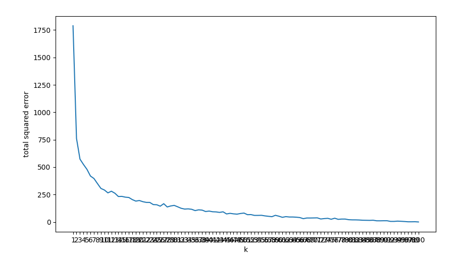
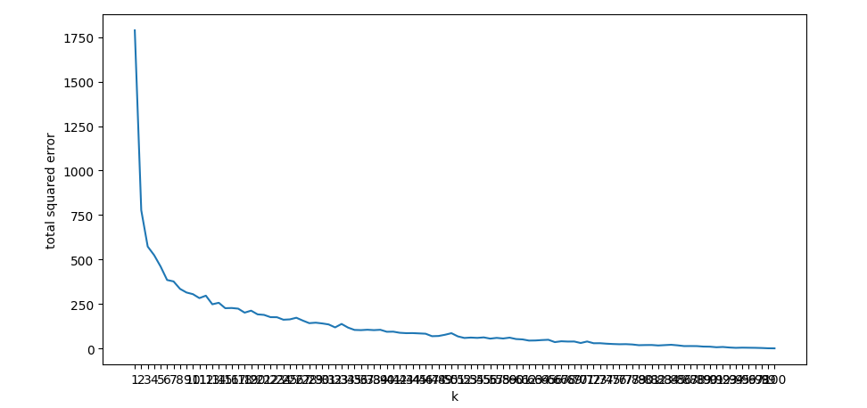
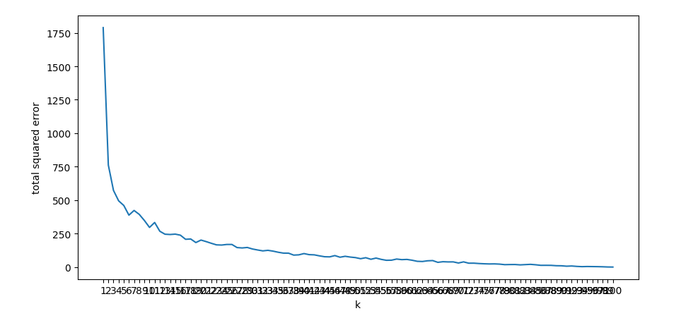

# Кластеризация 
## Задание к работе 
Написать программу на Python, осуществляющую кластеризацию по методу k средних на выборке данных размерностью не менее 5 и объемом не менее 30.
## Выполнение 
Кластеризация проводиласть на выборке данных размерности 5 и объемом 100
### k = 1

### k = 20

### k = 47
